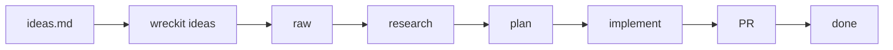

# wreckit


A CLI tool for turning ideas into automated PRs through an autonomous agent loop.

## Quick Start

```bash
# Install
npm install -g wreckit

# Initialize in a repo (creates .wreckit/)
cd my-project
wreckit init

# Ingest ideas
wreckit ideas < IDEAS.md

# Run everything
wreckit
```

## How It Works

Transform ideas into shipped PRs through a simple workflow:

```
ideas → research → plan → implement → PR → done
```



1. **Ingest** - Parse freeform ideas into structured items
2. **Research** - Analyze codebase and document findings
3. **Plan** - Break down into user stories with acceptance criteria
4. **Implement** - Code each story, commit, and verify
5. **PR** - Create pull request for review
6. **Done** - PR merged

## CLI Reference

### Core Commands

| Command | Description |
|---------|-------------|
| `wreckit` | Run all items until done (TUI) |
| `wreckit init` | Initialize .wreckit/ in the current repository |
| `wreckit ideas < FILE` | Ingest ideas from stdin |
| `wreckit ideas --file PATH` | Ingest from file |
| `wreckit status` | List all items with state |
| `wreckit status --json` | JSON output for scripting |
| `wreckit show <id>` | Show item details |
| `wreckit run <id>` | Run single item through all phases |
| `wreckit run <id> --force` | Regenerate artifacts |
| `wreckit next` | Run next incomplete item |
| `wreckit doctor` | Validate all items |
| `wreckit doctor --fix` | Auto-fix recoverable issues |

### Phase Commands

Run individual phases for testing/debugging:

| Command | Transition |
|---------|------------|
| `wreckit research <id>` | raw → researched |
| `wreckit plan <id>` | researched → planned |
| `wreckit implement <id>` | planned → implementing |
| `wreckit pr <id>` | implementing → in_pr |
| `wreckit complete <id>` | in_pr → done |

### Global Flags

| Flag | Description |
|------|-------------|
| `--verbose` | Detailed logs |
| `--quiet` | Errors only |
| `--no-tui` | Disable TUI (for CI) |
| `--dry-run` | Show what would be done |

## Configuration

Configuration is stored in `.wreckit/config.json`:

```json
{
  "schema_version": 1,
  "base_branch": "main",
  "branch_prefix": "wreckit/",
  "agent": {
    "command": "amp",
    "args": ["--dangerously-allow-all"],
    "completion_signal": "<promise>COMPLETE</promise>"
  },
  "max_iterations": 100,
  "timeout_seconds": 3600
}
```

### Options

| Option | Default | Description |
|--------|---------|-------------|
| `base_branch` | `"main"` | Branch to create PRs against |
| `branch_prefix` | `"wreckit/"` | Prefix for feature branches |
| `max_iterations` | `100` | Max agent iterations per item |
| `timeout_seconds` | `3600` | Timeout per phase (1 hour) |

### Agent Configuration

**Amp (default):**
```json
{
  "agent": {
    "command": "amp",
    "args": ["--dangerously-allow-all"],
    "completion_signal": "<promise>COMPLETE</promise>"
  }
}
```

**Claude:**
```json
{
  "agent": {
    "command": "claude",
    "args": ["--dangerously-skip-permissions", "--print"],
    "completion_signal": "<promise>COMPLETE</promise>"
  }
}
```

## Folder Structure

```
.wreckit/
├── config.json                    # Configuration
├── index.json                     # Item registry
├── prompts/                       # Prompt templates
│   ├── research.md
│   ├── plan.md
│   └── implement.md
└── <section>/
    └── <nnn>-<slug>/
        ├── item.json              # Metadata, state
        ├── research.md            # Research output
        ├── plan.md                # Implementation plan
        ├── prd.json               # User stories
        ├── prompt.md              # Generated agent prompt
        └── progress.log           # Append-only learnings
```

### File Descriptions

| File | Description |
|------|-------------|
| `config.json` | Global configuration for the project |
| `index.json` | Registry of all items with current state |
| `prompts/*.md` | Customizable prompt templates |
| `item.json` | Item metadata (title, state, PR info) |
| `research.md` | Codebase analysis and findings |
| `plan.md` | Step-by-step implementation plan |
| `prd.json` | User stories with acceptance criteria |
| `progress.log` | Learnings and notes from implementation |

## Customization

### Prompt Templates

Customize prompts by editing files in `.wreckit/prompts/`:

- `research.md` - Research phase prompt
- `plan.md` - Planning phase prompt  
- `implement.md` - Implementation phase prompt

### Template Variables

| Variable | Description |
|----------|-------------|
| `{{id}}` | Item ID (e.g., `features/001-dark-mode`) |
| `{{title}}` | Item title |
| `{{section}}` | Section name |
| `{{overview}}` | Item description |
| `{{item_path}}` | Path to item folder |
| `{{branch_name}}` | Git branch name |
| `{{base_branch}}` | Base branch (e.g., `main`) |
| `{{completion_signal}}` | Signal string for completion |
| `{{research}}` | Contents of research.md |
| `{{plan}}` | Contents of plan.md |
| `{{prd}}` | Contents of prd.json |
| `{{progress}}` | Contents of progress.log |

## Development

### Prerequisites

- Node.js 18+
- Bun (for development)

### Setup

```bash
git clone https://github.com/mikehostetler/wreckitloop.git
cd wreckitloop
bun install
```

### Build

```bash
bun run build
```

### Run Tests

```bash
bun run test
```

### Run in Development

```bash
bun run dev
```

### Contributing

1. Fork the repository
2. Create a feature branch
3. Make your changes
4. Run tests: `bun run test`
5. Submit a pull request

## Exit Codes

| Code | Meaning |
|------|---------|
| 0 | Success |
| 1 | Error |
| 130 | Interrupted (Ctrl-C) |

## License

MIT
